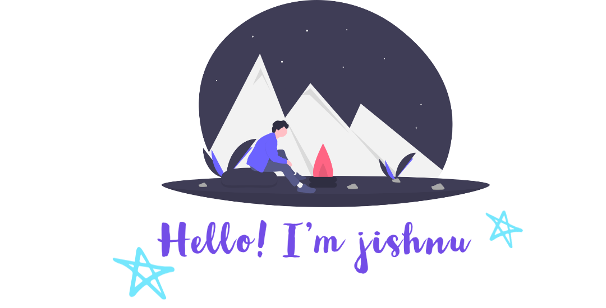

 

I'm a Full-Stack developer.

**About me**

- 💼  Full-Stack & Creative Web Developer 

- 📈 Built Webapplication using NextJs, ReactJs,NodeJs and Express

- ❤️ I love building website and fun experiments.

- 💬 Ask me about anything [Jishnu B](mailto:jishnubalakrishnan26@gmail.com?subject=[GitHub]%20Source%20Han%20Sans)
 

   

   
   
   
   
   
   
   
      

      

   
   
   
   
   
   
   
   

   

 
 

   
  

 
 

   
   
   

